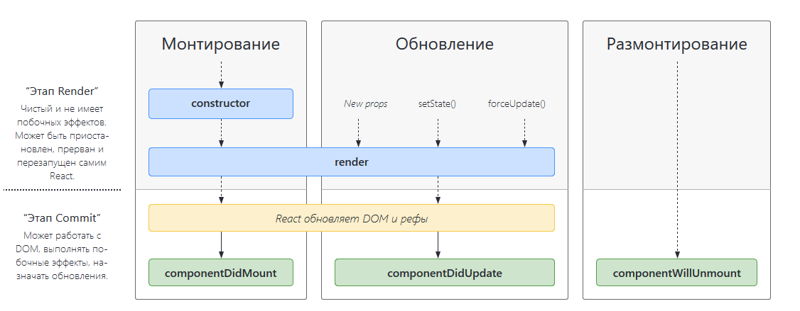

<h1>React</h1>
<hr>

<h3>Создание приложения</h3>

```shell
npx create-react-app my-app
cd my-app
npm start
```

<h3>Hello world:</h3>

```javascript
import React from 'react';
import ReactDOM from 'react-dom';
import './index.css';

ReactDOM.render(
  <h1>Привет, мир!</h1>,
  document.getElementById('root')
);
```
<hr>
<h3>Функциональные и классовые компоненты</h3>

Это 
```javascript
function Welcome(props) {
  return <h1>Привет, {props.name}</h1>;
}
```
Тоже самое что и это
```javascript
class Welcome extends React.Component {
  render() {
    return <h1>Привет, {this.props.name}</h1>;
  }
}
```
<b>Компонент с конструктором класса с начальные состоянием</b>
```javascript
class Clock extends React.Component {
  constructor(props) {
    super(props);
    this.state = {date: new Date()};  }

  render() {
    return (
      <div>
        <h1>Привет, мир!</h1>
        <h2>Сейчас {this.state.date.toLocaleTimeString()}.</h2>
      </div>
    );
  }
}
```
<hr>


<h3>Компоненты жизненного цикла</h3>




<h3>Компоненты с задержкой</h3>

Пример: 


```javascript
import React, { Suspense } from 'react';

const OtherComponent = React.lazy(() => import('./OtherComponent'));

function MyComponent() {
  return (
    <div>
      <Suspense fallback={<div>Загрузка...</div>}>
        <OtherComponent />
      </Suspense>
    </div>
  );
}
```


<h3>Рефы</h3>
Рефы дают возможность получить доступ к DOM-узлам или React-элементам, созданным в рендер-методе.

```javascript
class CustomTextInput extends React.Component {
  constructor(props) {
    super(props);
    // создадим реф в поле `textInput` для хранения DOM-элемента
    this.textInput = React.createRef();    this.focusTextInput = this.focusTextInput.bind(this);
  }

  focusTextInput() {
    // Установим фокус на текстовое поле с помощью чистого DOM API
    // Примечание: обращаемся к "current", чтобы получить DOM-узел
    this.textInput.current.focus();  }

  render() {
    // описываем, что мы хотим связать реф <input>
    // с `textInput` созданным в конструкторе
    return (
      <div>
        <input
          type="text"
          ref={this.textInput} />        <input
          type="button"
          value="Фокус на текстовом поле"
          onClick={this.focusTextInput}
        />
      </div>
    );
  }
}
```


```javascript
class CustomTextInput extends React.Component {
  constructor(props) {
    super(props);
    // создадим реф в поле `textInput` для хранения DOM-элемента
    this.textInput = React.createRef();    this.focusTextInput = this.focusTextInput.bind(this);
  }

  focusTextInput() {
    // Установим фокус на текстовое поле с помощью чистого DOM API
    // Примечание: обращаемся к "current", чтобы получить DOM-узел
    this.textInput.current.focus();  }

  render() {
    // описываем, что мы хотим связать реф <input>
    // с `textInput` созданным в конструкторе
    return (
      <div>
        <input
          type="text"
          ref={this.textInput} />        <input
          type="button"
          value="Фокус на текстовом поле"
          onClick={this.focusTextInput}
        />
      </div>
    );
  }
}
```

```javascript
function CustomTextInput(props) {
  // textInput должна быть объявлена здесь, чтобы реф мог иметь к ней доступ  const textInput = useRef(null);
  function handleClick() {
    textInput.current.focus();  }

  return (
    <div>
      <input
        type="text"
        ref={textInput} />      <input
        type="button"
        value="Фокус на поле для ввода текста"
        onClick={handleClick}
      />
    </div>
  );
}
```