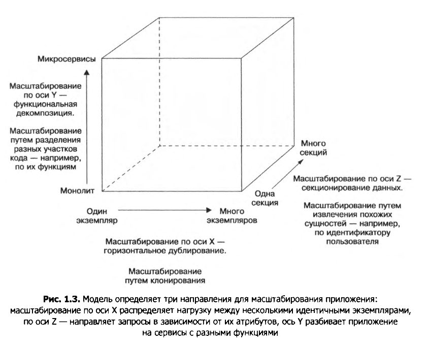
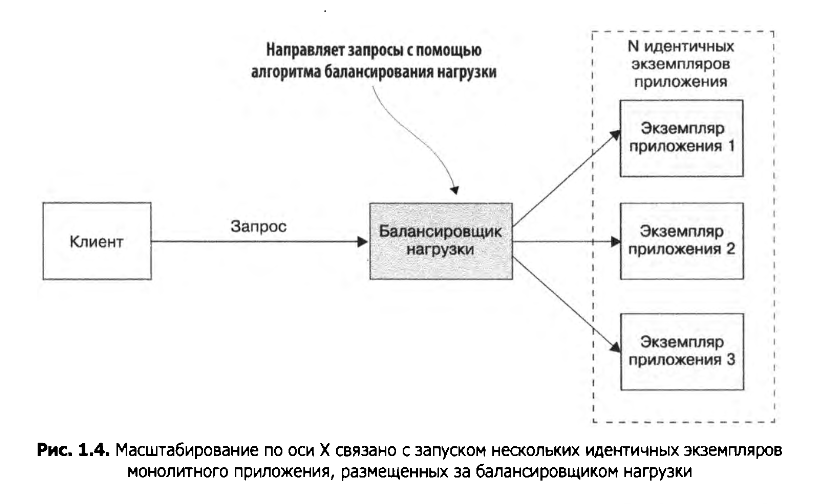
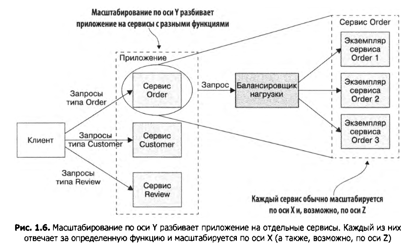
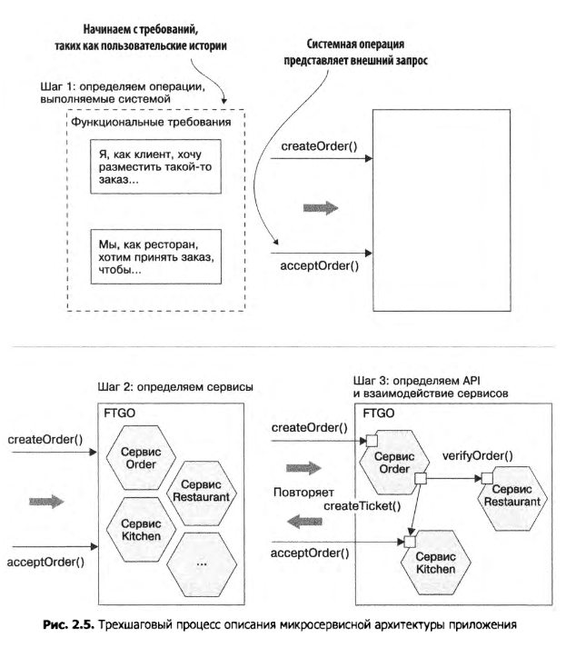

<h1>Микросервисы. Патерны. Описание</h1>

Модель масштабирования приложения:

</img>

</img>

</img>

</img>


Преимущества монолитной архитектуры на ранних этапах:

<ul>
    <li>Простота разработки</li>
    <li>Лёгкость внесения радикальных изменений</li>
    <li>Простота тестирования</li>
    <li>Простота развёртывания</li>
    <li>Лёгкость масштабирования</li>
</ul>

Сложности возникающее с ростом приложения:


<ul>
    <li>Сложность разработки/li>
    <li>Медленная разработка</li>
    <li>Длинный и тяжёлый путь от сохранения изменений до их развёртывания</li>
    <li>Трудности с масштабированием</li>
    <li>Сложность добиться надёжности</li>
    <li>Зависимость от постепенно устаревающего стека технологий</li>
</ul>

<b>В микросервисной архитектуре единицей модульности является сервис.</b>

<b>У каждого сервиса есть своя база данных.</b>

SOA - service-oriented architecture

```
| Параметр            | SOA                        | Микросервисы             |
| ------------------- |:--------------------------:| ------------------------:|
| Межсерверное  вз-ие |Умные каналы, такие как     |Примитивные каналы, такие |
|                     |сервисная шина предприятия, |как брокер сообщений, или |
|                     |c использованием            |прямое взаимодействие     |
|                     |тяжёловестных протоколов    |между сервисами с помощью |
|                     |вроде SOAP и других         |легковесных протоколов    |
|                     |веб-сервисных стандартов    |наподобие REST или gRPC   |
| ------------------- |:--------------------------:| ------------------------:|
| Данные              |Глобальная модель данных    |Отдельная модель данных   |
|                     |и общие ДБ                  |и БД для каждого сервиса  |
| ------------------- |:--------------------------:| ------------------------:|
| Типовой сервис      |Крупное монолитное          |Небольшой сервис          |
|                     |приложение                  |                          |
```

Достоинства микросервисной архитектуры:

<ul>
    <li>Она делает возможным непрерывные доставку и развёртывание крупных, сложных приложений </li>
    <li>Сервисы получаются небольшимим и простыми в обслуживании</li>
    <li>Сервисы развёртываются независимо друг от друга</li>
    <li>Сервисы масштабируются независимо друг от друга</li>
    <li>Микросервисная архитектура обеспечивает автономность команд разработчиков</li>
    <li>Она позволяет эксперементировать и внедрять новые технологии</li>
    <li>В ней лучше изолированы неполадки</li>
</ul>

Недостатки микросервисной архитектуры:

<ul>
    <li>Сложность подобрать подходящий набор сервисов</li>
    <li>Сложность распределённых систем затрудняет разработку, тестирование и развёртывание</li>
    <li>Развёртывание функций, охватывающих несколько сервисов, требует тщательной координации</li>
    <li>Решение о том, когда следует переходить на микросервисную архитектуру, является нетривиальным</li>
</ul>


Ключевая идея микросервисной архитектуры - <b>функциональная</b> декомпозиция.


Программнаяа архитектура вычислительной системы — это набор структур, 
    необходимых для ее обсуждения и состоящих из программных элементов,
    связей между нимии свойств, присущих этим элементам и связям.


Декомпозиция важна, по след. причинам:

<ul>
    <li>Она способствует разделению труда и знаний, так как позволяет нескольким 
    людям или командам с потенциально узкоспециализированным знаниями продуктивно работать нвд одним приложением</li>
    <li>Она определяет как взаимодействуют между собой программные элементы</li>
</ul>

Процесс описания микросервисной архитектуры:

</img>

Сервисы должны быть основаны на бизнес-концепциях, а не на технических аспектах.


Предметно-ориентированное проектирование (domain-driven design, DDD) - это способо построения сложных приложений, 
основанный на разработке объектно-ориентированной доменной (проблемной) модели.


Трудности при разбиении приложения на сервисы:

<ul>
    <li>Латентность сети</li>
    <li>Ухудшение доступности из-за синхронного взаимодействия</li>
    <li>Поддержание согласованности данных между сервисами</li>
    <li>Получение согласованного представления данных</li>
    <li>Божественные классы, препятствующие декомпозиции</li>
</ul>


Межпроцессорное взаимодействие (inter-process communication, IPC) - обмен данными между потоками одного
или разных процессов.

IPC на основе запросов/ответов:
<ul>
    <li>REST</li>
    <li>gRPC</li>
</ul>

IPC на основе асинхронных сообщений:
<ul>
    <li>AMQP</li>
    <li>STOMP</li>
</ul>

AMQP(Advanced Message Queuing Protocol) - открытый протокол для передачи сообщений между компонентами системы. 
Основная идея состоит в том, что отдельные подсистемы (или независимые приложения)
могут обмениваться произвольным образом сообщениями через AMQP-брокер, который осуществляет маршрутизацию,
возможно гарантирует доставку, распределение потоков данных, подписку на нужные типы сообщений. 


STOMP(Streaming Text Oriented Messaging Protocol) - ранее известный как TMPP,  ориентированный на потоки протокол 
обмена сообщениями.  Изначально реализованный в Apache ActiveMQ и проектировавшийся с учётом простоты, 
STOMP в настоящее время поддерживается во множестве реализаций брокеров и имеет клиентские библиотеки для большинства 
языков программирования.


Первым делом описываем интерфейсю Затем рассматриваем полученный результат с клиентскими разработчиками. И только 
после окончания работы над API реализуете сам сервис.


Семантическая нумерация версий <b>MAJOR.MINOR.PATCH</b>

<ul>
    <li>MAJOR - при внесении в API несовместимого изменения</li>
    <li>MINOR - при изменении API с сохранением обратной совместимости</li>
    <li>PATCH - при исправлении ошибки с сохранением обратной совместимости</li>
</ul>


Недостаток применения тексктовых форматов связан с тем, что сообщения полуучаются довольно объёмными.
Ещё одной отрицательной стороной являются накладные расходы на разбор текста,
особенно в ходе работы с большимим сообщениями. Если важны эффективность и производительность, 
лучше подумать об использовании двоичных форматов.


Преимущества REST:
<ul>
    <li>Он простой и привычный</li>
    <li>API на основе HTTP можно тестировать в браузере (Postman)</li>
    <li>Он имеет встроенную поддержку стиля взаимодействия вида "запрос/ответ"</li>
    <li>Протокол HTTP дружествен к браузерам</li>
    <li>Он не нуждается в промежуточном брокере, что упрощает архитектуру системы.</li>
</ul>

Недостатки REST:

<ul>
    <li>Он поддерживает лишь стиль взаимодействия "запрос/ответ"</li>
    <li>
        Степень доступности снижена. Поскольку клиент и сервис взаимодействуют между собой напрямую,
        без промежуточного звена для буферизации сообщений, они оба должны работать на протяжении всего обмена данными
    </li>
    <li>Клиенты должны знать местонахождение (URL) экземпляра (-ов) сервиса</li>
    <li>Извлечение нескольких ресурсов за один запрос связано с определёнными трудностями</li>
    <li>Иногда непросто привязать к HTTP-командам несколько операций обновления</li>
</ul>


Платформа gRPC более эффективна, чем использование обычных HTTP-запросов. gRPC построен на основе HTTP/2, позволяющем 
выполнять несколько запросов параллельно поточно-безопасным способом. Сообщения gRPC хранятся в бинарном виде и весят меньше, чем JSON. 