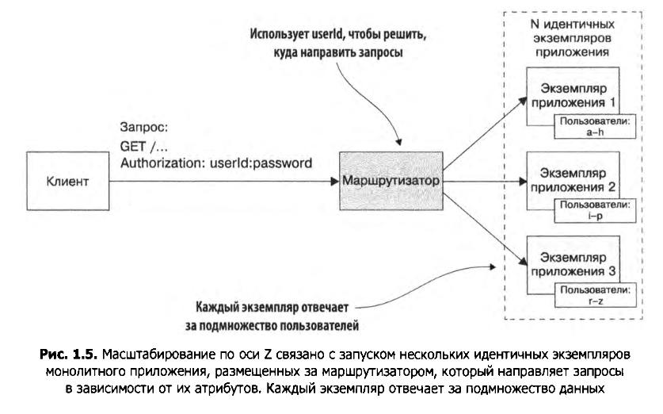

<h1>Микросервисы. Патерны. Описание</h1>

Модель масштабирования приложения:

</img>

</img>

</img>

</img>


Преимущества монолитной архитектуры на ранних этапах:

<ul>
    <li>Простота разработки</li>
    <li>Лёгкость внесения радикальных изменений</li>
    <li>Простота тестирования</li>
    <li>Простота развёртывания</li>
    <li>Лёгкость масштабирования</li>
</ul>

Сложности возникающее с ростом приложения:


<ul>
    <li>Сложность разработки/li>
    <li>Медленная разработка</li>
    <li>Длинный и тяжёлый путь от сохранения изменений до их развёртывания</li>
    <li>Трудности с масштабированием</li>
    <li>Сложность добиться надёжности</li>
    <li>Зависимость от постепенно устаревающего стека технологий</li>
</ul>

<b>В микросервисной архитектуре единицей модульности является сервис.</b>

<b>У каждого сервиса есть своя база данных.</b>

```
| Параметр            | SOA                        | Микросервисы             |
| ------------------- |:--------------------------:| ------------------------:|
| Межсерверное  вз-ие |Умные каналы, такие как     |Примитивные каналы, такие |
|                     |сервисная шина предприятия, |как брокер сообщений, или |
|                     |c использованием            |прямое взаимодействие     |
|                     |тяжёловестных протоколов    |между сервисами с помощью |
|                     |вроде SOAP и других         |легковесных протоколов    |
|                     |веб-сервисных стандартов    |наподобие REST или gRPC   |
| ------------------- |:--------------------------:| ------------------------:|
| Данные              |Глобальная модель данных    |Отдельная модель данных   |
|                     |и общие ДБ                  |и БД для каждого сервиса  |
| ------------------- |:--------------------------:| ------------------------:|
| Типовой сервис      |Крупное монолитное          |Небольшой сервис          |
|                     |приложение                  |                          |
```

Достоинства микросервисной архитектуры:

<ul>
    <li>Она делает возможным непрерывные доставку и развёртывание крупных, сложных приложений </li>
    <li>Сервисы получаются небольшимим и простыми в обслуживании</li>
    <li>Сервисы развёртываются независимо друг от друга</li>
    <li>Сервисы масштабируются независимо друг от друга</li>
    <li>Микросервисная архитектура обеспечивает автономность команд разработчиков</li>
    <li>Она позволяет эксперементировать и внедрять новые технологии</li>
    <li>В ней лучше изолированы неполадки</li>
</ul>

Недостатки микросервисной архитектуры:

<ul>
    <li>Сложность подобрать подходящий набор сервисов</li>
    <li>Сложность распределённых систем затрудняет разработку, тестирование и развёртывание</li>
    <li>Развёртывание функций, охватывающих несколько сервисов, требует тщательной координации</li>
    <li>Решение о том, когда следует переходить на микросервисную архитектуру, является нетривиальным</li>
</ul>

