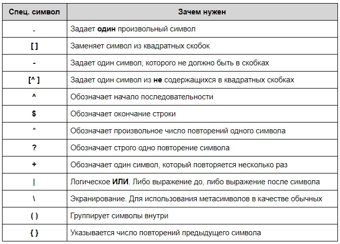

<h1>Регулярные выражения</h1>

`.` - Один любой символ, кроме новой строки.

`?` - 0 или 1 вхождение шаблона слева.

`+` - 1 и более вхождений шаблона слева.

`*` - 0 и более вхождений шаблона слева.

`\w` - Любая цифра или буква (`\W` — все, кроме буквы или цифры).

`\d` - Любая цифра `[0-9]` (`\D` — все, кроме цифры).

`\s` - Любой пробельный символ (`\S` — любой непробельный символ).

`\b` - Граница слова.

`[..]` - Один из символов в скобках (`[^..]` — любой символ, кроме тех, что в скобках).

`\ ` - Экранирование специальных символов (`\.` означает точку или `\+` — знак «плюс»).

`^` и `$` - Начало и конец строки соответственно.

`{n,m}` - От n до m вхождений (`{,m}` — от 0 до m).

`a|b` -	Соответствует a или b.

`()` -	Группирует выражение и возвращает найденный текст.

`\t, \n, \r` - Символ табуляции, новой строки и возврата каретки соответственно